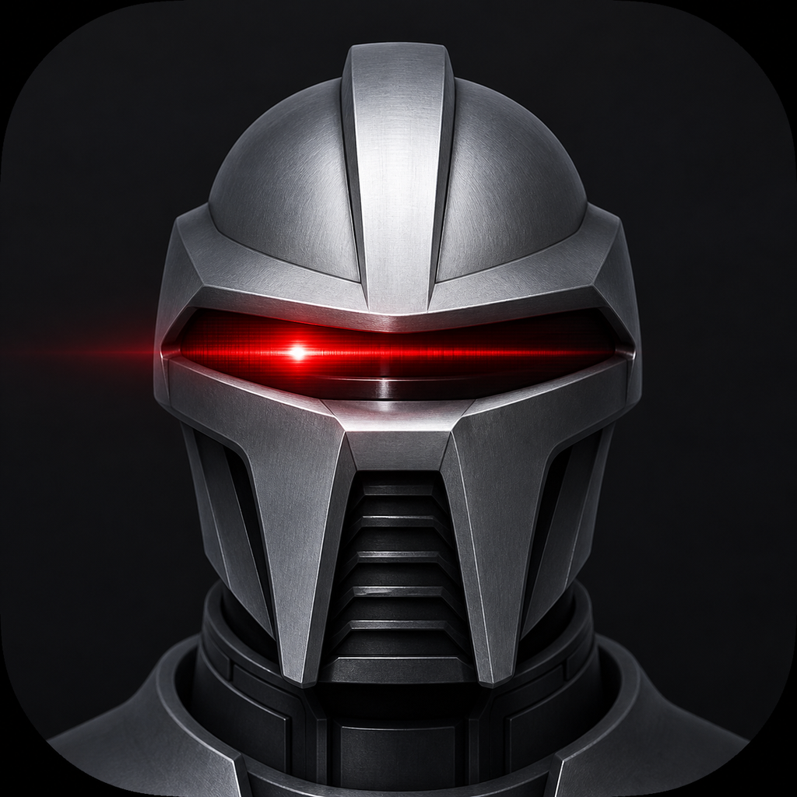

# ScanSave 📄

> A minimal iOS document scanner that automatically saves each scan as a PDF — no extra taps, no confirmation dialogs.

<p align="center">
  
</p>

## Features

- 📷 **One-tap scanning** — Open the document camera, scan, and the PDF is saved instantly.
- ⚙️ **Configurable file names** — Customize the prefix and date format in the Settings screen.
- 📂 **Files app integration** — All PDFs appear in the Files app under *On My iPhone → ScanSave*.
- 🤖 **Zero intervention** — No share sheets, no previews, no confirmation alerts.
- 💾 **Auto-save** — PDFs are generated and saved on a background thread immediately after scanning.
- ✅ **Haptic feedback** — A subtle buzz and a Dynamic Island-style toast confirm the save.

## File Naming

The naming pattern is `{prefix} {date}.pdf`. Configure both in the settings screen (tap the gear icon).

| Date Format           | Example Output                        |
|-----------------------|---------------------------------------|
| `YYYY-MM-DD`          | `S-24 2026-05-03.pdf`                 |
| `YYYY-MM-DD HHhMM`    | `S-24 2026-05-03 16h53.pdf`           |
| `YYYY-MM-DD HHhMMmSSs`| `S-24 2026-05-03 16h53m47s.pdf`       |

> Note: Time separators use `h`, `m`, `s` instead of colons (`:`) because colons are invalid in file names on iOS.

## Requirements

- iOS 17.0+
- Xcode 15+
- A physical iPhone with a camera (the document camera is not available on simulators)

## Getting Started

```bash
git clone <repo-url>
cd ScanSave
open ScanSave.xcodeproj
```

1. In Xcode, select the **ScanSave** target → **Signing & Capabilities**.
2. Choose your **Team** from the dropdown (or add your Apple ID in *Xcode → Settings → Accounts*).
3. Connect your iPhone and select it as the build destination.
4. Press **Cmd+R** to build and run.
5. On first launch, go to *Settings → General → VPN & Device Management* on your iPhone and tap **Trust**.

## App Store Publishing

1. Enroll in the [Apple Developer Program](https://developer.apple.com/programs) ($99/year).
2. In Xcode, select **Any iOS Device (arm64)** as the scheme destination.
3. **Product → Archive**.
4. In the Organizer window, click **Distribute App → App Store Connect → Upload**.
5. Complete the app metadata, screenshots, and pricing in [App Store Connect](https://appstoreconnect.apple.com).

## Project Structure

```
ScanSave/
├── ScanSave.xcodeproj/              # Xcode project file
├── ScanSave/
│   ├── ScanSaveApp.swift            # @main app entry point
│   ├── ContentView.swift            # Main screen & scan flow
│   ├── SettingsView.swift           # File naming configuration
│   ├── DateFormat.swift             # Date format enum (3 options)
│   ├── DocumentScannerView.swift    # VisionKit camera wrapper
│   ├── PDFGenerator.swift           # PDF generation from images
│   ├── ToastView.swift              # Dynamic Island-style toast banner
│   ├── Assets.xcassets/             # App icon & accent color
│   │   └── AppIcon.appiconset/      # All icon sizes (20px–1024px)
│   └── Info.plist                   # Bundle metadata & permissions
├── scansavenoncylon.png             # Custom app icon source image
├── .gitignore                       # Xcode user data exclusions
└── README.md
```

## Tech Stack

| Layer | Technology |
|---|---|
| UI | SwiftUI (`NavigationStack`, sheets, forms) |
| Document Scanning | VisionKit (`VNDocumentCameraViewController`) |
| PDF Generation | PDFKit (`PDFDocument`, `PDFPage`) |
| Persistence | `@AppStorage` (UserDefaults) |
| Logging | `os` (unified logging system) |
| Minimum Deployment | iOS 17.0 |

## License

This project is provided for personal and educational use.
