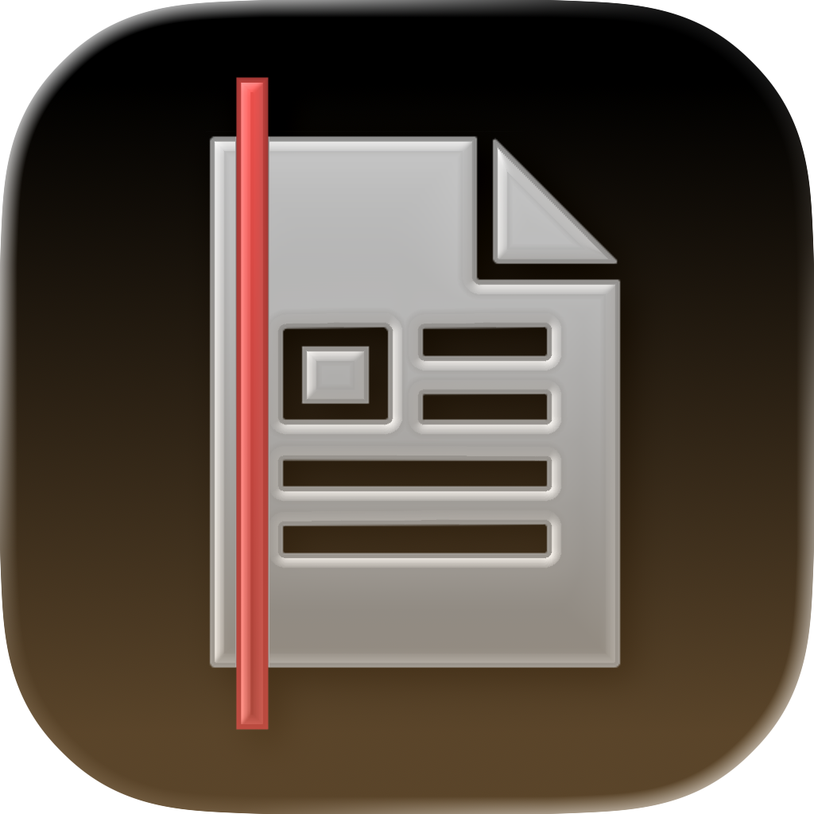
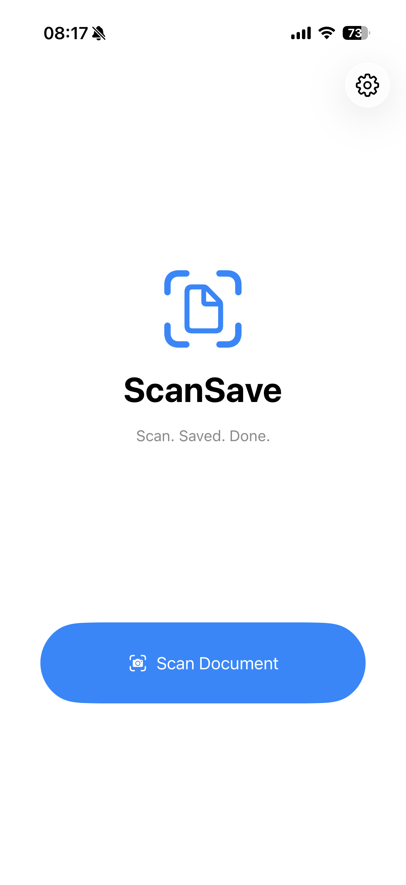
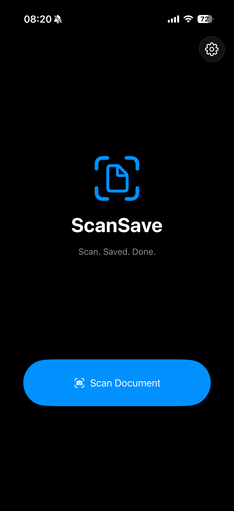
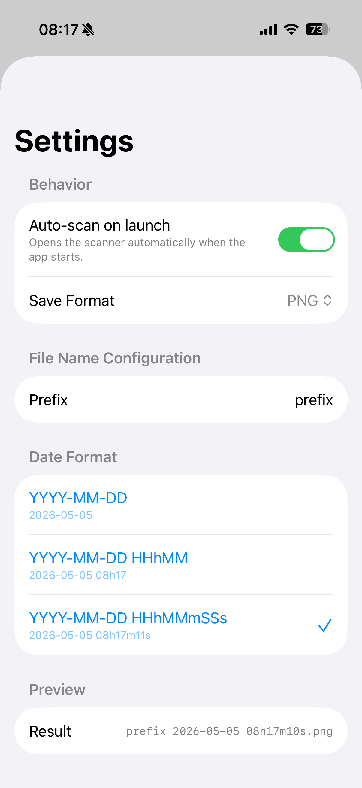
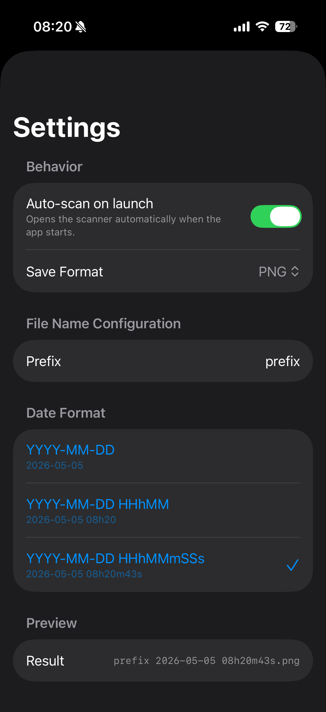

# Simply Scan 📄

> A minimal iOS document scanner that automatically saves each scan as a PDF or PNG — no extra taps, no confirmation dialogs.

<p align="center">
  
</p>

## Features

- 📷 **One-tap scanning** — Open the document camera, scan, and the file is saved instantly.
- ⚙️ **Configurable settings** — Customize the prefix, date format, save format (PDF/PNG), and auto-scan behavior.
- 📂 **Files app integration** — All files appear in the Files app under *On My iPhone → Simply Scan*.
- ✅ **Zero intervention** — No share sheets, no previews, no confirmation alerts.
- 💾 **Background auto-save** — Files are generated and saved on a background thread immediately after scanning.
- ✅ **Saved. Done.** — A brief on-screen confirmation appears after each save, then fades away.
- 🚀 **Auto-scan mode** — Optionally open the scanner automatically when the app launches.

## Screenshots

<p align="center">
  
  
  
  
</p>

## File Naming

The naming pattern is `{prefix} {date}.{ext}`. Configure everything in the settings screen (tap the gear icon).

**Default:** `prefix 2026-05-03 16h53m47s.pdf`

| Date Format           | Example Output                            |
|-----------------------|-------------------------------------------|
| `YYYY-MM-DD`          | `prefix 2026-05-03.pdf`                   |
| `YYYY-MM-DD HHhMM`    | `prefix 2026-05-03 16h53.pdf`             |
| `YYYY-MM-DD HHhMMmSSs`| `prefix 2026-05-03 16h53m47s.pdf`         |

> Time separators use `h`, `m`, `s` instead of colons (`:`) because colons are invalid in file names on iOS.

**Save formats:**
- **PDF** — All scanned pages combined into a single multi-page PDF.
- **PNG** — Saves the first scanned page as a PNG image.

## Requirements

- iOS 17.0+
- Xcode 15+
- A physical iPhone with a camera (the document camera is not available on simulators)

## Getting Started

```bash
git clone <repo-url>
cd SimplyScan
open SimplyScan.xcodeproj
```

1. In Xcode, select the **SimplyScan** target → **Signing & Capabilities**.
2. Choose your **Team** from the dropdown (or add your Apple ID in *Xcode → Settings → Accounts*).
3. Connect your iPhone and select it as the build destination.
4. Press **Cmd+R** to build and run.
5. On first launch, go to *Settings → General → VPN & Device Management* on your iPhone and tap **Trust**.

## Settings

| Setting | Description | Default |
|---|---|---|
| Auto-scan on launch | Opens the scanner automatically 1s after launch | Off |
| Save Format | Choose between **PDF** (multi-page) or **PNG** (single page) | PDF |
| Prefix | Custom text before the date in the file name | `prefix` |
| Date Format | One of three date/time suffix formats | `YYYY-MM-DD HHhMMmSSs` |

## App Store Publishing

1. Enroll in the [Apple Developer Program](https://developer.apple.com/programs) ($99/year).
2. In Xcode, select **Any iOS Device (arm64)** as the scheme destination.
3. **Product → Archive**.
4. In the Organizer window, click **Distribute App → App Store Connect → Upload**.
5. Complete the app metadata, screenshots, and pricing in [App Store Connect](https://appstoreconnect.apple.com).

## Project Structure

```
SimplyScan/
├── SimplyScan.xcodeproj/            # Xcode project file
├── SimplyScan/
│   ├── SimplyScanApp.swift          # @main app entry point
│   ├── ContentView.swift            # Main screen & scan flow
│   ├── SettingsView.swift           # File naming & behavior config
│   ├── DateFormat.swift             # Date format enum (3 options)
│   ├── DocumentScannerView.swift    # VisionKit camera wrapper
│   ├── PDFGenerator.swift           # PDF generation from images
│   ├── PNGGenerator.swift           # PNG image saving
│   ├── Assets.xcassets/             # App icon & accent color
│   │   ├── AppIcon.appiconset/      # All icon sizes (20px–1024px)
│   │   └── scanrobotsaved.imageset/ # (unused — legacy confirmation image)
│   └── Info.plist                   # Bundle metadata & permissions
├── .gitignore                       # Xcode user data exclusions
├── screenshots/                     # App preview images
│   ├── iPhoneScreenshotScan.PNG
│   ├── iPhoneScreenshotScanDark.PNG
│   ├── iPhoneScreenshotSettings.PNG
│   └── iPhoneScreenshotSettingsDark.PNG
└── README.md
```

## Tech Stack

| Layer | Technology |
|---|---|
| UI | SwiftUI (`NavigationStack`, sheets, forms) |
| Document Scanning | VisionKit (`VNDocumentCameraViewController`) |
| PDF Generation | PDFKit (`PDFDocument`, `PDFPage`) |
| Persistence | `@AppStorage` (UserDefaults) |
| Logging | `os` (unified logging system) |
| Minimum Deployment | iOS 17.0 |

## License

This project is provided for personal and educational use.
